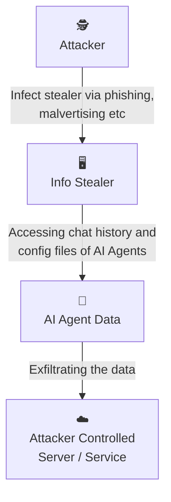
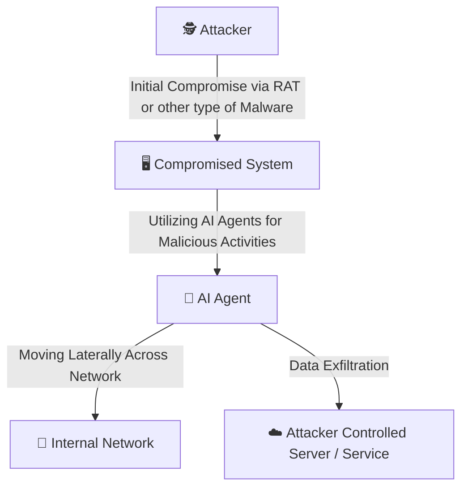

---
author:
    name: nxb1t
    avatar: https://nxb1t.is-a.dev/assets/img/profile.jpeg
date: 2026-02-24
category:
    - Artificial Intelligence
    - Threat Intelligence
    - Threat Hunting
tags: [Artificial Intelligence ,Threat Intelligence, Threat Hunting]
---

# AI Agents as Attack Vectors

Hello everyone,<br>
In my previous [post](https://nxb1t.is-a.dev/artificial-intelligence/mcp_for_dfir/), I explored the use of MCP servers and LLM for DFIR use cases and highlighted their benefits. In this blog, I am looking into a different perspective: the potential abuse of AI agents by threat actors and the impact they could have on an enterprise environment.

We are already seeing the growing popularity of AI coding agents such as Claude Code and other general-purpose AI agents like [OpenClaw](https://github.com/openclaw/openclaw) (previously known as Moltbot/Clawdbot). These agents often have access to significant amounts of sensitive information, including source code, project data, and other critical components that users work on. This makes them highly valuable targets for threat actors.

## How Threat Actors Can Leverage AI Agents

I have been following the latest developments in the AI agent landscape, and two potential attack scenarios came to my mind. The first is the classic Infostealer scenario. The second scenario is Agentic attacks which could be part of supply chain or a standalone payload abusing AI agents.

## Scenario 1: Infostealers

Infostealers are nothing new, they are a persistent and well-established threat. Over the years, numerous threat research reports have shown that this threat is not going away anytime soon. Threat actors continue to refine their delivery techniques, using methods such as ClickFix-style social engineering to distribute stealer malware. So far the traditional infostealers targeted mostly browser cookies, saved passwords, crypto wallets and other sensitive information.

In this scenario, we explore a critical question: what happens if infostealers begin targeting and exfiltrating data from AI agents? These agents may store credentials, API keys, configuration files, project data, and other sensitive information. The compromise of such data could significantly amplify the impact of a traditional infostealer infection.

While writing this blog, I came across reports that threat actors have already started weaponizing stealers to exfiltrate configuration files of AI Agents. For example, a recent report in The Hacker News highlights an infostealer campaign specifically targeting [OpenClaw AI agent configuration files](https://thehackernews.com/2026/02/infostealer-steals-openclaw-ai-agent.html).

### AI Agents Data Source

Let's imagine a threat actor executed the following attack and exfiltrated huge volume of AI Agents data from user machines.



Understanding where AI agents store data locally is critical to detect this type of attack and its impact. Below, we examine several popular AI agent tools and highlight where sensitive artifacts are stored, this data is useful during Digital Forensic Investigations as well.  All the AI agents in this demonstration are running with default configurations, which reflects how most users typically operate them.

!!! Note
In the examples below, I use prompts that include fake API keys and other hardcoded test data. Modern AI models have significantly evolved and will usually warn users if they detect exposed API keys, often recommending key rotation. Therefore, the likelihood of valid, active API keys being present in conversational history may be lower. However, other forms of sensitive and critical information may still reside in these stored artifacts.
!!!

| AI Agent | Data Path  |
| ------------ | ------------- |
| Antigravity  | `~/.gemini/`   | 
| Claude       | `~/.claude/`   | 
| Codex        | `~/.codex/`    |
| OpenCode     | `~/.local/share/opencode/` |

If an attacker exfiltrates the entire data path of agents, they can gain:

* Source code snapshots
* Development context
* Prompt history
* Architectural insights
* Potential secrets embedded in conversations

This contextual intelligence can significantly enhance follow-on attacks.

#### Antigravity

[Antigravity](https://antigravity.google/) is an agent-first IDE developed by Google DeepMind. It functions as a VS Code wrapper with extended capabilities for agentic workflows.

Unlike many AI coding agents, Antigravity supports multiple operating modes:

* **Fully agentic mode** – the AI autonomously performs tasks while the user supervises.
* **Assistant mode** – the user retains more control, and the agent provides targeted assistance.

To demonstrate potential data exposure, I asked the Gemini model to generate a Python script containing hardcoded credentials.


##### Conversation Storage

Antigravity stores conversation history under:

```
~/.gemini/antigravity/conversations
```

The data is saved in encrypted Protocol Buffer (`.pb`) files. These files are not easily readable using basic tools like `strings` or standard text editors.


##### Key Storage

On macOS, encryption keys are stored in the system Keychain. There are publicly available Python scripts capable of decrypting the conversation files using the Antigravity Safe Storage key.


##### Code Tracker Artifacts

Even if decryption is unsuccessful, valuable artifacts remain accessible. For example: `~/.gemini/antigravity/code_tracker` . This directory contains tracked source code and contextual metadata.


#### Claude Code

Claude Code is Anthropic’s agentic CLI coding assistant. It allows developers to delegate complex tasks such as refactoring, code generation, debugging, and repository-wide modifications directly from the terminal. Here I am asking the agent to read `.env` file which had some github Keys, I used ollama for model provision since I didn't had a premium account for their sonnet and opus models.


The chat history was stored under `~/.claude/projects/` folder.


#### Codex

Codex is an AI agent developed by OpenAI. Similar to Claude, it provides powerful agentic coding capabilities through a CLI-based interface. For this example I asked the agent to inspect a python script which had hardcoded docker api key. At the end of conversation the codex model suggested to rotate the keys.


However the conversation history and API key was found under : `~/.codex/sessions/`


#### OpenCode

OpenCode is an opensource AI agent, it can be used with any models and supports features similar to Claude Code. Similar to codex example, some AWS keys were given to gpt 5.2 and the model refused to work with it, instead suggested to rotate the keys and consider them as compromised.


Unlike claude and codex, opencode stores conversational data in a database file under `~/.opencode/opencode.db` and also under `~/.opencode/storage/part` as json format. API key were found in the history files.


### Detecting the Exfiltration

So how can we detect potential exfiltration of AI agent data?

Monitoring file paths is easier on both Windows and Linux because EDRs provide excellent visibility into file events. Even if you are not using an EDR, you can monitor the agent paths using `Sysmon` on Windows or `auditd` on Linux and build custom alerts.

Here is a simple auditd rule to detect OpenCode data exfiltration :-

```yaml
-a always,exit -F arch=b64 -S open,openat -F dir=/home/ubuntu/.local/share/opencode -F key=exfil_detect
-a always,exit -F arch=b32 -S open,openat -F dir=/home/ubuntu/.local/share/opencode -F key=exfil_detect
```

A python script was run to zip the opencode directory and drop in the current tmp directory.


macOS is a different case, some file events are detected by EDR solutions, while most others are not. Let's take a look at how the events are detected in [Mac Monitor](https://github.com/Brandon7CC/mac-monitor), an advanced, stand-alone system monitoring tool tailor-made for macOS security research. 

The same script was ran but this time targeting claude.


The python execution and zip creation is visible in the EDR event stream.


However the targeted folder couldn't be found, So I guess this is a macOS limitation.


Even if no proper host events are obtained, we can detect the exfiltration based on network signatures and correlating them with available host events.

## Scenario 2: Agentic Attacks

Just as defenders leverage AI for diverse DFIR use cases, threat actors have begun adopting these technologies in parallel. We are seeing a marked increase in the use of AI to develop custom C2 (Command & Control) servers, implants, and broader malware infrastructures. Notably, threat actors who previously specialized in a single programming language are now using AI to rewrite malware in languages like Rust or Go to evade signature-based detection, even when the underlying intent remains the same.

We are entering a new phase of malware evolution where payloads are becoming semi-autonomous or fully autonomous through AI integration. This shift grants attackers the ability to deploy malware at scale, dynamically altering TTPs (Tactics, Techniques, and Procedures) in real-time to bypass security controls.

I have categorized this evolution into two primary sub-scenarios:

1. **AI Supply Chain Attacks**: Exploiting vulnerabilities in the models, frameworks, or third-party integrations (like MCP servers) that agents rely on.

2. **Agent Hijacking & Abuse**: Weaponizing legitimate, locally installed agents to perform malicious activities such as lateral movement or data harvesting.

### AI Supply Chain Attacks

In the early days of LLM adoption, our understanding of supply chain attacks was largely limited to poisoned models and arbitrary code execution during model loading. While these risks are still relevant, the AI infrastructure has evolved significantly, introducing powerful features like MCP ([Model Context Protocol](https://modelcontextprotocol.io/docs/getting-started/intro)) for Function calling and [Agent Skills](https://agentskills.io/home).

These new integrations have quickly become the most accessible and prominent vectors for supply chain compromise. By exploiting a malicious MCP server or a compromised "Skill" repository, a threat actor can hijack an AI agent's logic. Instead of just generating text, the agent can be manipulated to execute malicious programs, exfiltrate local files, or perform unauthorized actions on the host system.

Check out this blog by Mohamed Ghobashy on [MCP supply chain attack](https://securelist.com/model-context-protocol-for-ai-integration-abused-in-supply-chain-attacks/117473/) to see it in action.

### Agent Hijacking & Abuse

While I was writing this, Checkpoint released a fantastic report - [AI in the Middle: Turning Web-Based AI Services into C2 Proxies & The Future Of AI Driven Attacks](https://research.checkpoint.com/2026/ai-in-the-middle-turning-web-based-ai-services-into-c2-proxies-the-future-of-ai-driven-attacks/). This research explores several AI-driven attack scenarios, specifically covering API-based and AI-bundled malware. They also showcased an attack where Grok and Copilot was abused to act as Command-and-Control relays which was awesome and at the same time scary.

As I continued exploring AI agents, I started thinking about an additional scenario :-



What if attackers abuse locally installed AI agents for lateral movement and other operations, without relying on API keys or bundled models?. Well, I plan to showcase this in my next post, where I will conduct a full adversary simulation and threat hunting exercise. Stay tuned!

## Conclusion

As AI agents become more deeply integrated into enterprise workflows, they also introduce a new and evolving attack surface. Securing them requires more than traditional security architecture. 

Some points to be noted :-

* **Adopt a "Defense-in-Depth" Mindset**: The first and most critical step is acknowledging that no security control is perfect. While an EDR might catch 99% of threats, the remaining 1% can still cause catastrophic damage. Rather than relying on a single policy, develop a multi-layered security architecture to minimize the "blast radius" and overall impact.

* **Do Not Ignore Low-Severity Alerts**: Seemingly low-severity alerts can often represent early reconnaissance, policy testing, or partial exploitation attempts. Treat low-severity signals as potential indicators of emerging attack chains, correlate them with other telemetry, and investigate patterns over time rather than dismissing them in isolation.

* **Monitor Agent Activity and File Integrity**: Proactively monitor the file paths and directories used by AI agents. It is essential to detect if unauthorized or malicious programs are accessing agent configurations, memory logs, or integration settings. Also look for keychain and other sensitive information access.

* **Audit the AI Supply Chain**: Supply chain attacks in the AI ecosystem are real. Just as we audit npm or Python packages for malicious code, it is now crucial to perform security audits on MCP servers and Agent Skills. Enforce strict governance and allowlisting policies to prevent supply chain compromise.

* **Leverage Continuous Threat Intelligence**: Regularly ingest Threat Intelligence (TI) feeds and industry reports to stay current with the latest AI-driven attack trends and adversary tactics.

* **Proactive Threat Hunting**: Identify new AI features and potentially abusable vectors as they are released. Use these findings to build hypothetical attack scenarios and conduct proactive threat-hunting exercises within your environment.

