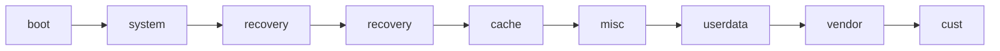

---
author:
    name: nxb1t
    avatar: https://nxb1t.is-a.dev/assets/img/profile.jpeg
date: 2023-08-2
category:
  - Android
  - Digital Forensics
tags: [Android, Digital Forensics]
---

# Android Forensics - An Introduction


Hello Friends, <br> In this blog, we will explore Android Forensics, the process of acquiring Android device, anti-forensics techniques, and a practical example on analysis and recovery of deleted files from an Android device image.

#### Key Terminologies used in this blog

* Acquisition : The gathering of sensitive data during a digital forensic investigation

* Forensically Soundness : The application of a transparent digital forensics process that preserves the original meaning of data for production in a court of law

* Disk Image/Dump : A disk image/dump is a file containing the contents and structure of a disk volume or of an entire data storage device.

* ROM : Android Operating System, Stock ROMs are the Android OS which comes preinstalled with the phone. Custom ROMs are the modified Android OS maintained by open source communities.

* Block Device : Block Devices tend to be storage devices, capable of buffering output and storing data for later retreival. HDD, SSD etc are example for block device.

## Why Android Forensics

---

#### To Support An On Going Crime Investigation

Android Forensics helps in finding Digital evidence from Android Phones related to an ongoing criminal
investigation. If the accused is using Apple iPhone, iPhone forensics is applied. People use Smartphones for
both digital crimes and non-digital crimes. So Analysing these devices are crucial to solve
the investigations.

#### To Identify Malware

Malware attacks on smartphones have grown big recently. At least a single person in a household now owns a
smartphone. Most people do banking and purchasing through their smartphones. This has attracted many
threat actors. Varying from simple key loggers to ultimate Spywares ( like Pegasus) that keep spying on victims
24x7, the smartphone threats have become scary. Android Forensics and Mobile Forensics in general help in
identifying these threats on the incident.

## The Android Forensics Procedure

---

**Sieze and Isolate** : Seize the device (Mostly done on criminal investigations) and Isolate it to avoid Tampering data.

**Acquisition** : Create a copy of the device storage or files.
 
**Decryption** : Decrypt the storage if its encrypted.
 
**Analysis** : Analyse the collected evidence.

### Types Of Android Device Acquisitions

* **Physical Acquisition** <br>
  The process of creating a bit-by-bit copy of the storage device is known as Physical acquisition. With this method, we can analyse deleted files and system files. This type of acquisition can be done using software with elevated privilege (root access) or directly imaging the storage device using JTAG Interface, EDL Mode (bootloader implemented by SOC devs).

* **Logical Acquisition** <br>
  In this process, we are copying existing files from the device storage. Which means we can't analyse the deleted files and also key system files of the Android OS. This type of acquisition doesn't require root access.

* **Cloud Acquisition** <br>
  This method relies on cloud backup and other cloud data source. For example, WhatsApp chats can be analysed using WhatsApp cloud backups.


### Android Forensics Tools

List of different tools used in the Android Forensics realm.

| Tool Name | License Type | Description |
| --------- | ------------ | ----------- |
| [Autopsy Sleuthkit](https://www.autopsy.com/download/) | [!badge variant="success" text="Free"] | Autopsy is a GUI front-end of TSK with many custom modules and add-ons. |
| [Belkasoft Evidence Center X](https://belkasoft.com/x) | [!badge variant="warning" text="Paid"] | Evidence Center X is a flagship tool by Belkasoft for computer, mobile and cloud forensics. It can acquire and analyze a wide range of mobile devices and computers. |
| [Cellebrite UFED](https://cellebrite.com/en/ufed/) | [!badge variant="warning" text="Paid"] | Cellebrite UFED is a powerful platform to dump and analyse different portable devices like Mobile Phones, Drones , SIM card etc. |
| [Sleuthkit (TSK)](https://www.sleuthkit.org/) | [!badge variant="success" text="Free"] | TSK is a collection of command line tools and a C library that allows you to analyze disk images and recover files from them. |
| [Magnet Acquire](https://www.magnetforensics.com/resources/magnet-acquire/) | [!badge variant="success" text="Free"] | Easily acquire forensic images of any iOS or Android device, hard drive, and removable media |
| [Magnet AXIOM](https://www.magnetforensics.com/products/magnet-axiom/) | [!badge variant="warning" text="Paid"] | Magnet AXIOM is another platform capable of analyzing wide range of mobile devices. |
| [Oxygen Forensics Detective](https://www.oxygen-forensic.com/en/products/oxygen-forensic-detective)  | [!badge variant="warning" text="Paid"] | Oxygen Forensics Detective is an all-in-one forensic software platform built to extract, decode, and analyze data from multiple digital sources. |

## Android OS

---

Android is a mobile operating system based on modified version of the Linux kernel. Android's kernel is based
on the Linux kernel's long-term support(LTS) branches.

Android has another operating system, Trusty OS, which is Google's implementation of a Trusted Execution
Environment (TEE) OS that runs alongside Android. TEE is a secure area of the SOC chip. This enables
Hardware-backed keystorage to ensure encryption and decryption keys are securely handled. As a result the
keys are never loaded in the RAM and is protected from many ram based attacks.

### Android Partitions

There are several partitions in Android devices that serve different functions of boot process.
Google introduced new changes to partition layout since Android 11 and it is even more tweaked
in the recent Android 13 update (as of writing this blog).

In this section, we will cover the important partitions which are same across Android versions.



| Partition Name | Description |
| -------------- | ----------- |
| **boot**       | Contains a kernel image and a generic ramdisk |
| **system**     | Android Framwork |
| **recovery**   | Contains the recovery image. The recovery image holds a recovery program that lets the device boot into a recovery console for performing advanced recovery and maintenance operations. It contains a second complete Linux system i.e. independent OS, including a user-interface application, kernel and the special recovery binary that reads a package and uses its contents to update i.e, flash or wipe itself or any other partition particularly during OTA updates |
| **cache** | Temporary data storage |
| **misc**  | Used by recovery partition |
| **userdata / data** | Contains user-installed apps, media files and other user data |
| **vendor** | Contains proprietary files which are not distributed with AOSP, ie system applications and libraries added by OEMS |
| **cust** | Contains some preloaded system apss and regional settings which are installed on first use |


### Android Disk Encryption

Android uses FDE (Full-Disk Encryption) and FBE (File-Based Encryption) schemes to encrypt the internal storage. FDE was used as default from Android 5 till Android 9, since Android 10 FBE is used the default encryption scheme.

#### Full-Disk Encryption (FDE)

Android full-disk encryption is based on dm-crypt, which is a kernel feature that works at the block device layer. The encryption algorithm is 128 Advanced Encryption Standard (AES) with cipher-block chaining (CBC) and ESSIV:SHA256. The master key is encrypted with 128-bit AES via calls to the OpenSSL library. Upon first boot, the device creates a randomly generated 128-bit master key and then hashes it with a default password and stored salt. The default password is: `"default_password"` However, the resultant hash is also signed through a TEE (such as TrustZone), which uses a hash of the signature to encrypt the master key. The device can be encrypted using PIN, Password, Pattern or with the default password. One of the limitation of FDE is that the phone will be usable only after entering the credentials on boot, this is also known as `Secure Startup`. Which means, SMS, Receiving Calls , alarms and other services are not available if credentials are not provided. Most OEMs use default password for encryption.

FDE is suspect to these types of attacks:-
1. **Bruteforce Attack** : Bruteforcing the lockscreen using adb or an HID interface. Bruteforcing takes lots of times because OEMs use different schemes in their lockscreen timeout and also if the PIN/Password is long it will be relatively impossible to crack.
2. **Cold Boot Attack** : FDE decryption keys were loaded in RAM for decryption process. The keys can be extracted by creating a memory dump after cooling the RAM module. This attack is obsolete these days.

#### File-Based Encryption (FBE)

FBE allows different files to be encrypted with different keys that can be unlocked independently. FBE introduced a new boot method called Direct Boot. With Direct Boot, encrypted devices can boot straight into lock screen. On an FBE-enabled device, each user of the device has two storage locations available to applications: Credential Encrypted (CE) storage, which is the default storage location and only available after the user has unlocked the device and Device Encrypted (DE) storage, which is a storage location available both during Direct Boot mode and after the user has unlocked the device. Phone Dialer, Alarm and other important applications run on the DE storage after boot.


## Physical Acquisition of an Android Device

---

!!!info Info
Please note that the procedures mentioned in this blog are intended for an overview of acquiring Android devices. In real-world scenarios, such as in forensics labs, devices are isolated and protected from any form of data tampering, they also use professional tools for acquisition and analysis. Simulating those methods in a home lab is not feasible.
!!!

Let's do Physical Acquisition method on a FDE encrypted Android device.

> Device Specifications :- <br>
> Model : Xiaomi Redmi Note 6 Pro (Tulip) <br>
> ROM/OS : MIUI 11 (Android 9) <br>
> Recovery : TWRP Custom Recovery <br>
> Encryption : FDE ( with default password ) <br>

Required Tools:
* [Android SDK Platform Tools](https://developer.android.com/tools/releases/platform-tools)

### Preparing The Device

* Unlock Bootloader : Each Manufacturer has different methods to unlock bootloader. Refer to device forums to find the correct procedure, also please note that some manufacturers don't allow unlocking the bootloader.

* Install Custom Recovery : There are many custom recovery projects for Android. [TWRP Custom Recovery](https://twrp.me/Devices/) is the most popular one among them.
We can start a temporary recovery session with the commands given below.
To Permanently install TWRP in the device, refer to this [XDA Forums Post](https://www.xda-developers.com/how-to-install-twrp/)

```sh
nxb1t@4n6:~$ fastboot devices
nxb1t@4n6:~$ fastboot boot twrp-xx.img
```
TWRP supports decryption of both FDE and FBE, If the device is encrypted with the default password, TWRP will automatically decrypt the storage. Otherwise, the user will be asked to enter the password/pin code.

`Data` (userdata) partition and `Cache` partition are mounted by default in recovery. Only the mounted partitions are decrypted, so if we have to dump the `System` partition or any other partitions, we will have to mount them. Partitions can be mounted through the Mount option.

TWRP Menu --> Mount


We can determine the type of encryption by running the following command through adb. If the result is `block`, then it is FDE or if the result is `file`, it is FBE encryption.

```sh
nxb1t@4n6:~$ adb shell "getprop ro.crypto.type"
```


### Dumping Data Partition

Firs of all we have to determine the name of data partition. As we know, FDE encryption is based on dm-crypt, so the decrypted partition will be mounted on separate block device. We can list the mounted partitions through adb with the following commands :-

```sh
nxb1t@4n6:~$ adb shell "df -h"
nxb1t@4n6:~$ adb shell "ls /dev/block"
```

But before that, I will boot my device into Recovery Mode ( either with adb or by pressing the volume up button and power button, it will vary from device to device). Because Android doesn't allow root permissions via adb while its running in standard mode.


Here we can see `/dev/block/dm-0` which is mounted on `/data` mountpoint. That's the decrypted data partition we need to dump, because the custom recovery automatically decrypts it using the default password.

In the below image, we can see a block device named `mmcblk0`, which is equivalent to the `/dev/sda` device file we see in linux distros.


Dumping partitions are really easy, and the time consumption may vary depending on the partition size and speed of the devices. In our case, the internal storage size is 64 GB and the data partition around 50 GB. So, I dumped both `mmcblk0` block device and the `dm-0` block device, which totals to over 100 GB. `mmcblk0` is the encrypted internal storage, so I named its dump `encdisk.img` and for `dm-0` I named it `decdata.img`.

Block device names might vary depending on the devices, so make sure to enter the correct name while dumping the partition.

We will use the `adb pull` command to dump the block devices/partitions.

```sh
nxb1t@4n6:~$ adb pull /dev/block/mmcblk0 encdisk.img
nxb1t@4n6:~$ adb pull /dev/block/dm-0 decdata.img
```


## Analysing The Forensic Image

---

Ok, Now we can analyse our dumped data partition image using Autopsy Software.

Open Autopsy and Select New Case , Enter required info.


Select Disk Image as source type.


Select the required Modules, In our case I have only selected Picture Analyzer, Photorec, Central Repo and Android.


Once it starts processing the image, we can see many data artifacts such as call logs, contacts, messages etc in real-time. 


We can also use TSK command-line utilities to access forensic image contents, its really liteweight on the system but involves lots of manual work.

#### TSK command-line reference:-

```sh
# If the image is a single partition
nxb1t@4n6:~$ fls image.img [inode]
# If the image is entire storage
nxb1t@4n6:~$ fls -o partition_offset image.img [inode]
# Identifying partition offset
nxb1t@4n6:~$ mmls image.img
# To view file content
nxb1t@4n6:~$ icat image.img [inode]
```

* fls : fls lists the files and directory names in a file system.
* mmls : mmls displays the contents of a volume system (media management).
* icat : icat outputs the contents of a file in a disk image to STDOUT.


In the below screenshots, we have used mmls on the encdisk.img. Only a few partitions like the cache are
unencrypted. Userdata and other important partitions are encrypted. More TSK commands and their usage can be
found in [Sleuthkit wiki](http://wiki.sleuthkit.org/index.php?title=The_Sleuth_Kit_commands)


### Recovering Deleted Files

Before recovering the deleted files, let's see what's happening under the hood.

---

#### How Data Recovery Works:-

When we store files in hdd/ssd, the files are stored in blocks. Each block contains a piece of the file.
The first block usually contains the metadata for the file. When we delete a file, only the first block which
contains metadata is deleted. The operating system can no longer detect the file because it's metadata is lost
hence considers the blocks free for writing new file. Recovery tools read the storage sectors one by one, block
by block, and find correlated blocks. Once all the correlated blocks are found, the recovery utilities remake the
metadata. Since the blocks are marked free, there is a high chance of blocks getting overwritten by new files, hence the
recovered files might have the contents of an already existing file. So, It is highly recommended to recover file as quickly as possible to prevent overwriting.

---

For most of the users, Autopsy would be enough to recover the deleted files as it includes the tools listed
below, selecting all the files in Deleted Files category and exporting it to the desired folder will do the job.
But if you are using a low spec system and a data source with many files, then Autopsy won't be a good
option. Let's check at some command-line tools for data recovery.

* [tsk_recover](http://www.sleuthkit.org/sleuthkit/man/tsk_recover.html) : tsk_recover recovers files to the output_dir from the image. By default recovers only
unallocated files. With flags, it will export all files.


```sh
nxb1t@4n6:~$ tsk_recover image.img outpu_dir # recover unallocated files to output_dir
nxb1t@4n6:~$ tsk_recover -d directory_inode image.img output_dir # recover a single folder
```


* [PhotoRec](https://www.cgsecurity.org/wiki/PhotoRec) : PhotoRec is file data recovery software designed to recover lost files including video, documents
and archives.

```sh
nxb1t@4n6:~$ sudo apt install testdisk -y # Installing photorec in linux
nxb1t@4n6:~$ photorec image.img
```


Here are a couple of recovered files from the WhatsApp Images folder. As I mentioned before, some deleted
files are overwritten with existing files. So the data recovery success rate were around 60%.


## Anti-Forensic Techniques

---

Anti-forensic techniques are designed to completely hide data/traces related to a user from the system,
making investigation harder for Digital Forensic Investigators. There is both good and bad use cases for Anti-
Forensic Techniques. The good situation is when we sell our phone to a stranger or giving away to someone
else, It would be better to wipe our phone thoroughly. Because we don't know if they are notorious and have
skills in digital forensics. The bad use case would be criminals hiding and destroying evidences.

#### Disk Wipe

It is the first and foremost Anti-Forensic Technique. Deleting all of the data on a storage device. While simple
deletion doesn't prevent recovery, disk wipe make use of secure delete to surpass it. Each sectors from
beginning to end of the storage is overwritten using zeros. Individual files can be also securely deleted using
file shredders. Android doesn't have much reliable tools for file shredding and disk wiping. The only option is
to set the secure startup in FDE devices and set a long password and then format the device couple of times.
Same for the FBE devices, format it couple of times to make it impossible to get decryption keys.

#### File Encryption

As the name suggests, the file encryption technique encrypts files using passwords. In
Android, there are many apps for file encryption that makes use of TEE feature. Getting the correct password
will be a pain in this context.

#### Steganography

Steganography is the method of hiding file inside another file. This technique is pretty rare
but shouldn't be neglected. For example hiding text inside Audio, Image files etc.

## References

---

* [Android Partitions](https://source.android.com/docs/core/architecture/partitions)
* [Trusty TEE](https://source.android.com/docs/security/features/trusty)
* [Android rooting Guide](https://www.xda-developers.com/root/)

#### Further Learning

* [DFIRScience](https://www.youtube.com/c/DFIRScience)
* [Awesome Forensics](https://cugu.github.io/awesome-forensics/)
* [DFIR Resources](https://dfirdiva.com/dfir-resources/)
* [Stark4n6](https://start.me/p/q6mw4Q/forensics)
* [Alexis Brignoni Blog](https://abrignoni.blogspot.com/)