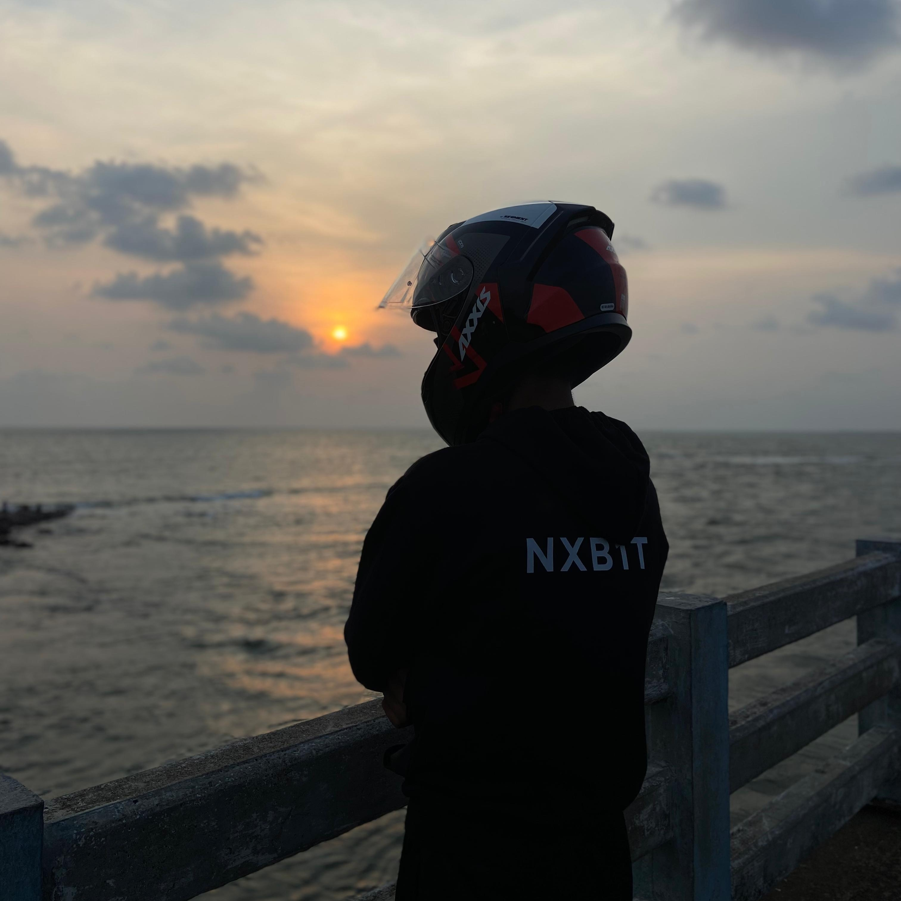

# About

Hello everyone, 
Welcome to my blog, here I will be sharing my latest findings and ideas in the fields of Digital Forensics and Malware analysis, as well as interesting CTF challenge writeups. I also have another blog where I previously posted CTF writeups and other tutorials, which you can find [here](nxb1t.neocities.org).

## Who Am I ?

---

  

I am Nashid P (nxb1t), a Second Year BSc Computer Science student from India. I am a passionate blogger who enjoys writing about my experiences in CTF competitions, as well as my insights and discoveries in the areas of malware analysis and DFIR. I am highly motivated to pursue a career in these fields and continuously work towards enhancing my knowledge and skills. Through my blog, I hope to share my enthusiasm with others and contribute to the community.

Core Member [@TamilCTF](https://tamilctf.pages.dev/)   
Security Researcher & Member [@InitCrew](https://initcrew.com/)  
Security Researcher [@SecureBinay](https://www.securebinary.in/author/nxb1t)

## Contributions

* Added ProtonVPN artifacts plugin to [ALEAPP Project](https://github.com/abrignoni/ALEAPP/pulls?q=is%3Apr+is%3Aclosed+author%3Anxb1t)
* Proposed VLC Media Player adb backup artifacts for ALEAPP Project